# **DocDirect - Portfolio Project 4**

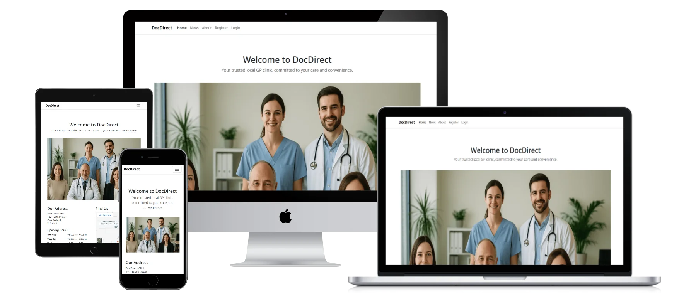 

# Overview
DocDirect is a general practitioner clinic management web app built using Django.
It enables patients to book appointments, GPs to manage patient consultations and notes,
and administrative staff to manage scheduling and news updates.

You can access the tool through the following link: <a href="https://docdirect-899b454f1def.herokuapp.com/" target="_blank"> DocDirect </a>

This README file outlines the features, usage, development process, and testing for the DocDirect web application.

---

# Contents
- [Overview](#overview)
- [Contents](#contents)
- [UX and Design](#ux-and-design)
- [User Stories](#user-stories)
- [Features](#features)
- [Future Features](#future-features)
- [Entity Relationship Diagrams](#entity-relationship-diagrams)
- [Installation and Deployment](#installation-and-deployment)
- [Technologies Used](#technologies-used)
- [Testing](#testing)
- [Bugs](#bugs)
- [Credits & Acknowledgements](#credits--acknowledgements)

---

# UX and Design

## Colour Scheme

- `#004085` (primary blue): used across navigation, buttons and section headers
- `#ffffff` (white): background and content card base
- `#e9ecef` (light grey): for visual separation, background of form inputs
- `#343a40` (dark grey): text and footer
- `#28a745` (green): success buttons and statuses
- `#dc3545` (red): error and delete actions

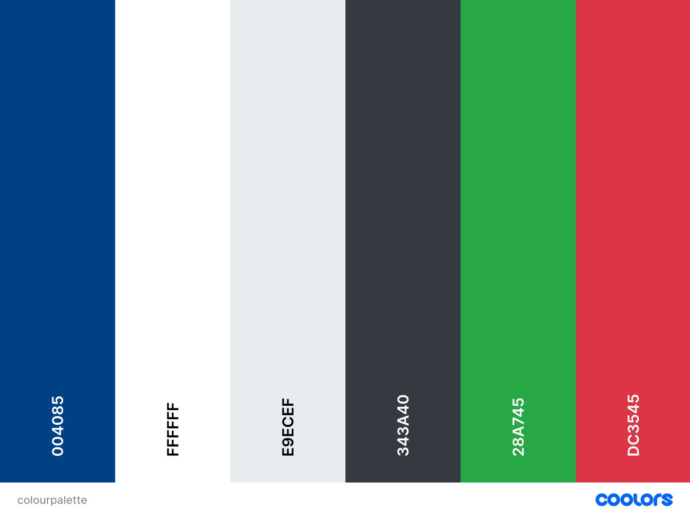 


## Typography

- **Lato**: used throughout the app for headings and body text.
- **Roboto**: used as fallback (android)
- **apple-system**: uses system font for apple devices
- **Helvetica Neue**: used if Lato is not available

## Layout and Visual Structure

Bootstrap 5 was used for styling and layout. The application follows a simple, responsive grid-based layout,
making the application usable across desktop, tablet, and mobile screens.

---

# User Stories

## Patients
- As a patient, I want to register and log in so I can manage my appointments.
- As a patient, I want to view upcoming appointments so I don’t miss them.
- As a patient, I want to book an appointment with a specific GP at a time that suits me.
- As a patient, I want to update my personal contact details and emergency contact.
- As a patient, I want to see confirmation of appointment success.

## GPs
- As a GP, I want to view a list of appointments assigned to me.
- As a GP, I want to open an appointment, add notes, and mark it as complete.
- As a GP, I want to see a patient’s history of past appointments.

## Administrative Staff
- As administrative staff, I want to log in and manage all appointments.
- As administrative staff, I want to edit the date or time or cancel appointments.
- As administrative staff, I want to create and publish news articles.

## Site Admin
- As a site admin, I want access to manage users and roles from the admin panel.
- As a site admin, I want to manage news posts and appointment records through the backend.

---

# Features

## Core Functionality

### Registration and Profile
- Custom signup logic including user profile creation.
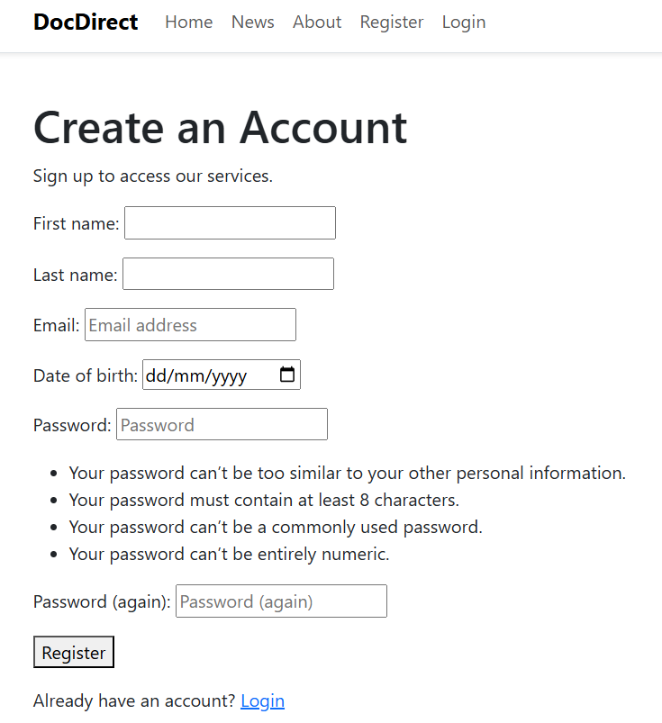 

- Update profile page for contact information and preferences.

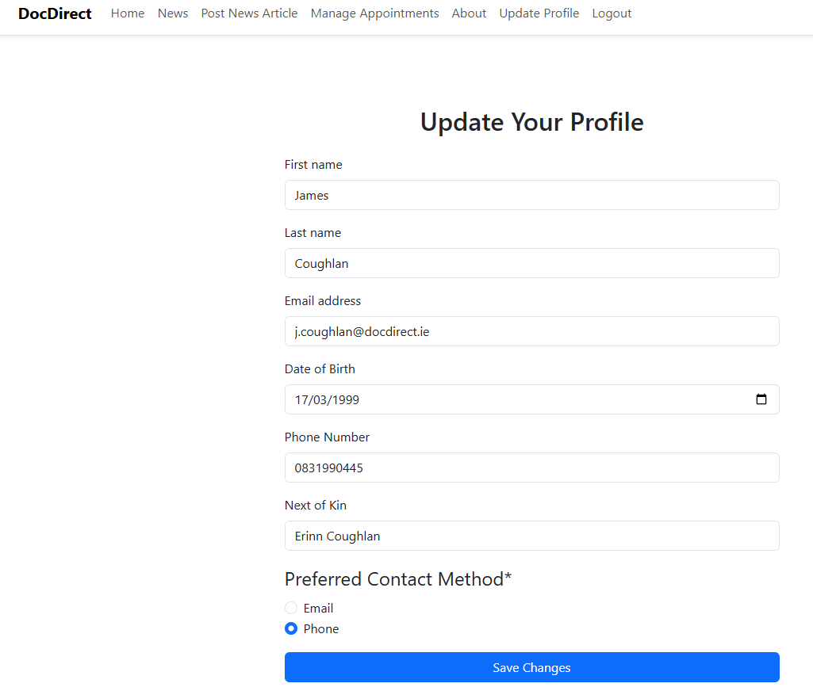 

### Appointments
- Role-based views:
    - Patients: see and book appointments.
    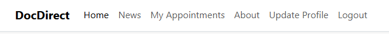 

    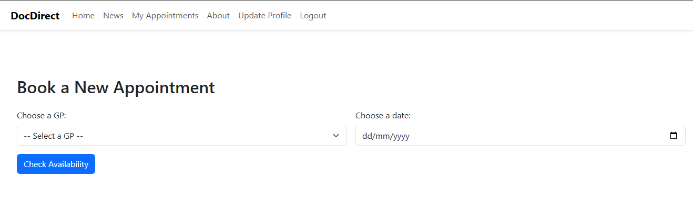 

    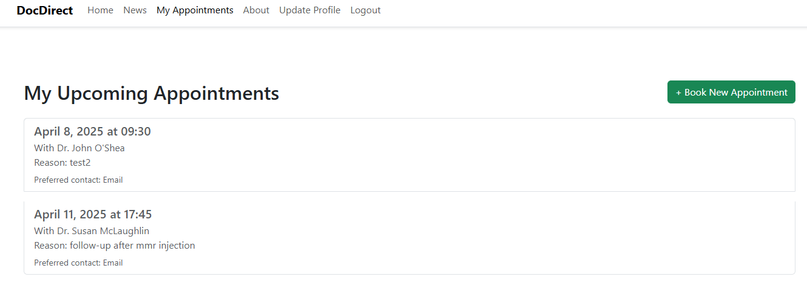 

    - GPs: see assigned appointments, add notes, mark as complete.

    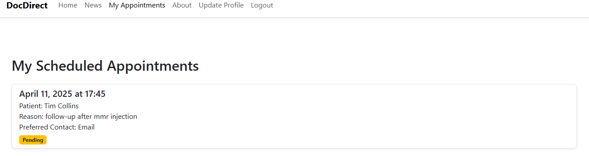 

    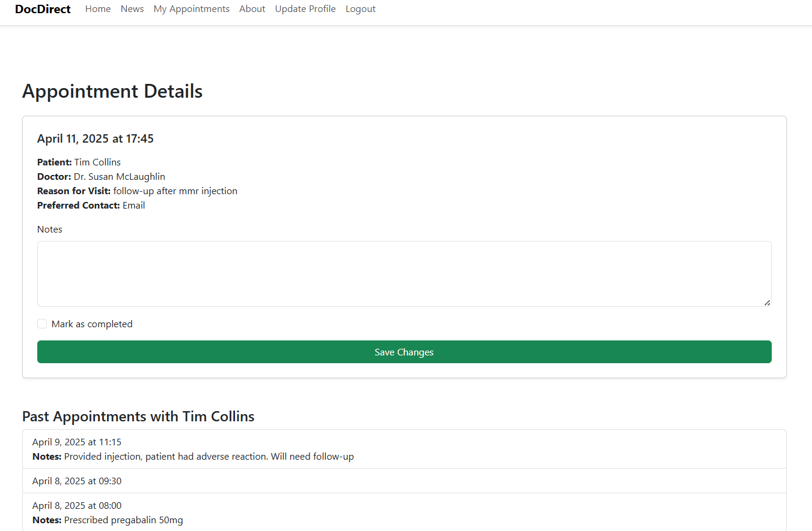 


    - Admin staff: manage all appointments and edit them.

    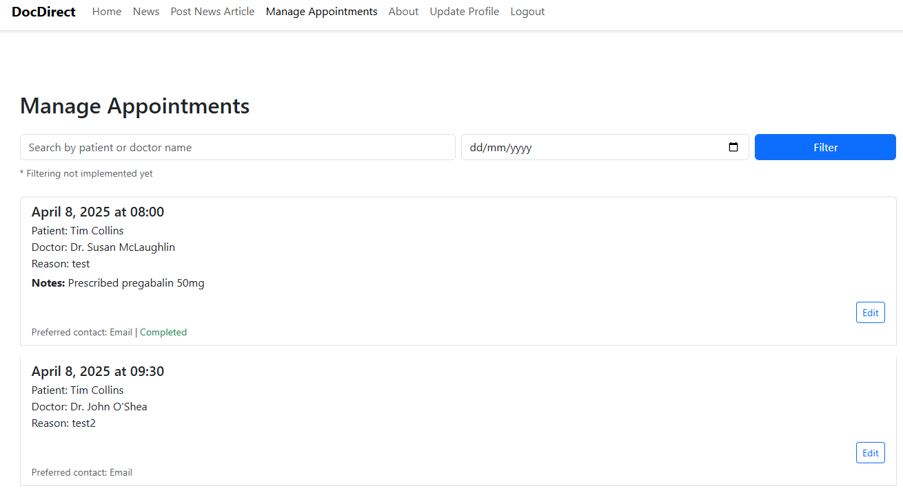 

### News Updates
- Create, publish, and manage news articles via frontend form (admin staff only).

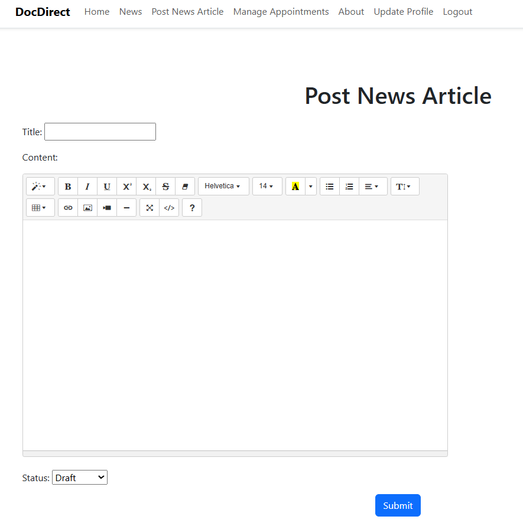

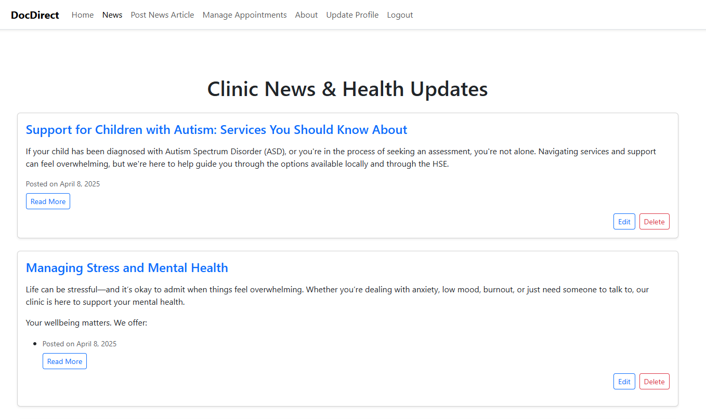

- News detail page with slugs for clean URLs.

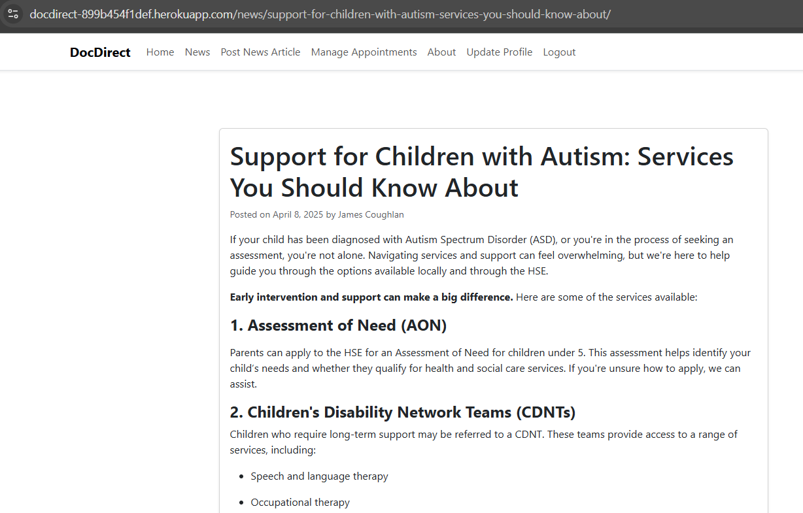

### Navigation
- Dynamic navbar based on user roles (patient, GP, admin).

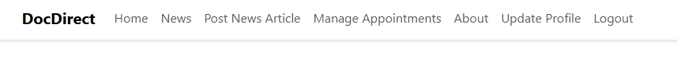  
- Quick access to role-specific pages.

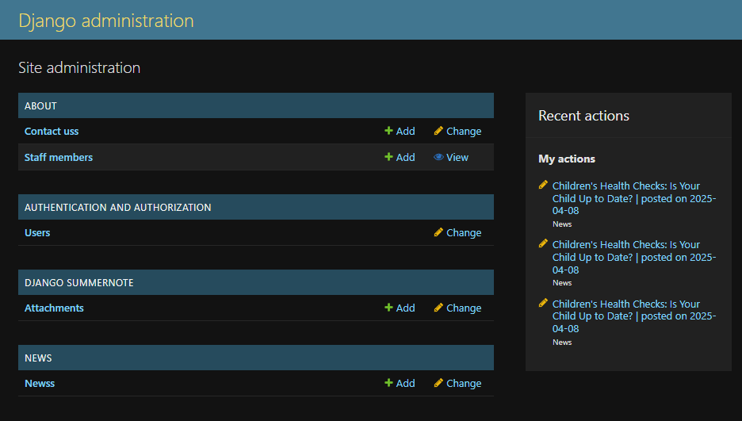 

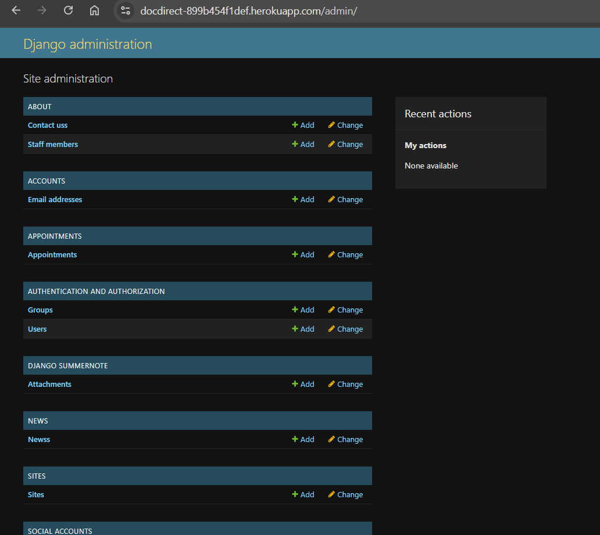 
---

# Future Features

- Patient view of previous appointments.
- Email or SMS notifications for upcoming appointments.
- Messaging between staff and patients.
- Search and filtering for administrative users.

---

# Entity Relationship Diagrams

## UserProfile

| KEY       | NAME              | TYPE        |
|-----------|-------------------|-------------|
| ForeignKey | user              | User        |
|           | date_of_birth     | DateField   |
|           | phone_number      | Char(15)    |
|           | next_of_kin       | Char(100)   |
|           | preferred_contact | Char(10)    |

## Appointment

| KEY        | NAME               | TYPE      |
|------------|--------------------|-----------|
| ForeignKey | patient            | User      |
| ForeignKey | gp                 | User      |
|            | date               | Date      |
|            | time               | Time      |
|            | reason_for_visit   | TextField |
|            | notes              | TextField |
|            | is_completed       | Boolean   |
|            | preferred_contact  | Char(10)  |

## Post

| KEY        | NAME     | TYPE        |
|------------|----------|-------------|
| ForeignKey | author   | User        |
|            | title    | Char(200)   |
|            | slug     | SlugField   |
|            | content  | TextField   |
|            | created  | DateTime    |
|            | updated  | DateTime    |

---

# Installation and Deployment

## Clone the repository

```bash
git clone https://github.com/mhesemans/docdirect.git
cd docdirect
```

## Create a virtual environment and install dependencies

```bash
python -m venv venv
source venv/bin/activate  # On Windows use `venv\Scripts\activate`
pip install -r requirements.txt
```

## Environment Setup

Create a `.env` or configure environment variables in your hosting panel for:

- `SECRET_KEY`
- `DATABASE_URL`
- `CLOUDINARY_URL`

## Deployment

Project is deployed on Heroku. Cloudinary is used for media hosting.

---

# Project Methodologies

## Agile Development in GitHub Projects

[GitHub Projects](https://github.com/users/mhesemans/projects/3/views/1) was used as a KANBAN board throughout this project.
The user stories were used to ensure all features were tested for intended purpose.

# Technologies Used

- Python & Django
- PostgreSQL
- Bootstrap 5
- JavaScript
- HTML5 / CSS3
- Gunicorn / Whitenoise
- Cloudinary
- GitHub & Git
- Heroku
- ChatGPT
- VSCode

---

# Testing

## Manual Testing

- All user flows were tested manually using different roles.
- Appointment booking tested across edge cases:
    - Invalid dates
    - Timeslot clashes
    - Missing GP

## Code Validation

### HTML

[HTML W3C Validator](https://validator.w3.org) was used to validate all html templates through direct input

Direct input was obtained from getting page source output after visiting the various pages in the app as most pages are authentication dependant.

While errors appear, they are all caused by the article preview getting cut off, crispy forms was used to create these articles.
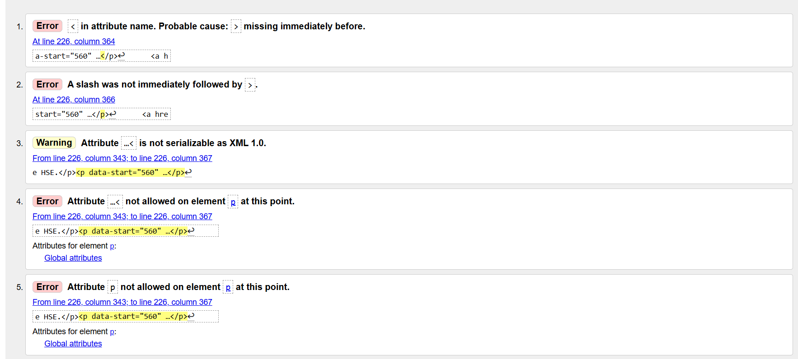

An error is also shown for the appointments view for administrative staff, however this is simply due to the search filter requiring the response to appear on the same page, as such the action value is left blank.

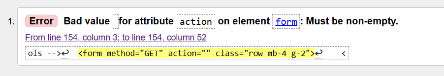

Other html templates show no errors

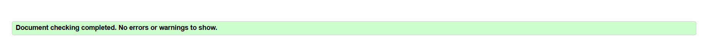

### CSS

[CSS Jigsaw Validator](https://jigsaw.w3.org/css-validator) was used to validate the style.css through direct input, this returned with no errors.

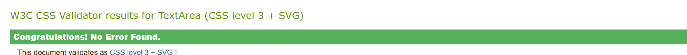

### Python

[CI Python Linter](https://pep8ci.herokuapp.com) was used throughout the development process, and apart from "line too long" instances, no errors remain

## Forms

- Validation was checked for required fields, date/time limits and dropdowns.
- Admin form views were tested with invalid/missing data.

## Authentication

- Login, logout, registration, profile update tested manually.

---

# Bugs

| Bug | Status | Fix |
|-----|--------|-----|
| GP detail view crashed on past appointment query | Fixed | Replaced naive datetime with aware |
| Admin not having UserProfile | Fixed | Create profile on superuser creation |
| 404 for `book_appointment` | Fixed | Missing path in `urls.py` |
| Time slots not GP-specific | Fixed | Filtered by GP on availability check |
| Style.css 404 | Fixed | Created and linked `style.css` in static |
| "Manage Appointments" 404 for superuser | Fixed | Added custom check for superuser to view |

---

# Credits & Acknowledgements

- Code Institute for Django course material
- Stack Overflow for troubleshooting advanced Django logic.
- [Coolors.co](https://coolors.co) for colour palette generation.
- [websitemockupgenerator] (https://websitemockupgenerator.com/) for mockup image of app
- [Django Documentation](https://docs.djangoproject.com/en/5.2/) for research
- Chatgpt for article content and image generation

Developed by Micha Hesemans.